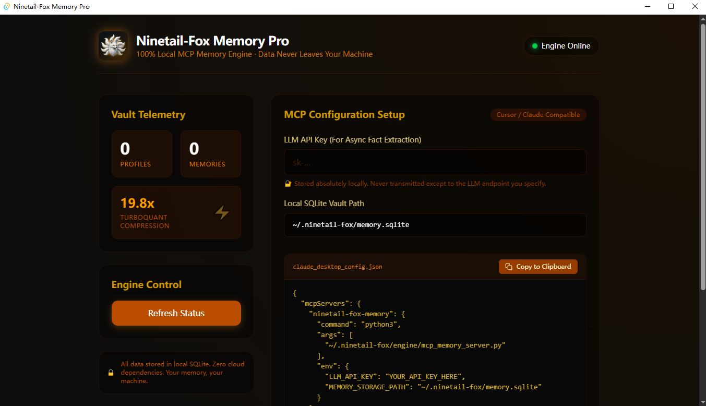

  

  <strong>The AI Memory Exoskeleton for Indie Hackers</strong> 
  100% local. Zero cloud dependency. Your context stays on your machine.

---

# 🦊 Ninetail-Fox Memory

Your AI forgets everything between conversations. Ninetail-Fox fixes that — **entirely on your local machine**.

All memory is stored in a local SQLite database. No cloud API calls for storage. No subscriptions. No data leaving your laptop. Period.

---

## 📸 Interface Preview

  

---

## 💡 Why Ninetail-Fox?

**The problem**: You teach Claude something at 2pm. By 3pm, in a new conversation, it's forgotten. You switch to Cursor — blank slate again. Your context, preferences, and project knowledge evaporate every single session.

**Existing solutions** (Supermemory, Mem0, etc.) route your data through cloud servers and charge monthly subscriptions. Your code snippets, architectural decisions, and personal preferences become someone else's training data.

**Ninetail-Fox** takes a different approach:

- **100% Local Storage**: Everything lives in a SQLite file on your machine. Not "local-first with cloud sync" — actually local-only.
- **Cross-Agent Sync via MCP**: Write a memory in Claude Desktop, read it in Cursor. Same local SQLite, accessed through the standard Model Context Protocol.
- **One-Time Purchase**: No monthly token fees. No per-query pricing. Buy once, own forever.

---

## 🔌 Supported Integrations

### ✅ Claude Desktop — Battle-Tested (My Daily Driver)

I use Claude Desktop with Ninetail-Fox every single day. The MCP integration for profile sync, fact extraction, and context injection has been through months of real-world usage. **This is where Ninetail-Fox is rock solid.**

Verified capabilities:
- `add_user_fact` / `get_user_profile` — read/write user traits across sessions
- `extract_facts` — automatic fact extraction from conversation text
- `add_memory` / `search_memory` — long-term memory storage and retrieval (requires embedding API)

### 🧪 Cursor — Beta (Community-Driven)

The underlying MCP architecture is fully wired up and **end-to-end verified**: Cursor can read profiles written by Claude Desktop, and vice versa. The SQLite bridge works.

However, I don't use Cursor as my primary editor, so edge cases in Cursor-specific workflows (inline completions, multi-file context, composer mode) haven't been stress-tested yet.

**If you're a heavy Cursor user, I'd genuinely love your feedback or PRs to help bulletproof this integration.**

### 🔜 Coming Soon

- **Windsurf / VS Code** — MCP support planned
- **Full vector memory search** — Currently requires an OpenAI-compatible embedding API. Working on built-in local embedding support to eliminate this dependency entirely.

---

## 🛠️ Under the Hood

  

The retrieval pipeline: **Bi-Encoder** (semantic rough filter) + **BM25** (keyword supplement) + **Cross-Encoder** (precision re-ranking) + **Time Decay** (recency weighting).

Profile sync (user traits) works out of the box with zero external dependencies. Full semantic memory search requires an embedding provider — OpenAI-compatible API or local model.

---

## 👑 V4.5 Pro — What You Get

The open-source edition gives you the basic framework. Pro is what I actually run daily:

| Feature | Open Source | Pro (V4.5) |
|---------|-----------|-------------|
| **Quantized Vectors** | Basic storage | **Google TurboQuant (Int8)** — 19.8x compression |
| **Memory Footprint** | Grows with usage | **Optimized LRU eviction** — constant low RAM |
| **Noise Filtering** | Simple keyword | **LittleFox Risk Algorithm** — thought-pruning |
| **Distribution** | Python source | **Native pre-built binaries** (Win/Mac/Linux) |
| **Backup** | Manual | **One-click reset & automated backup scripts** |

> **TurboQuant (Int8)**: Scalar quantization on 1536-dim vectors reduces memory fragmentation by 80%, enabling practically unlimited conversation memory under minimal RAM.

---

## 🚀 Get Pro (Early Bird)

Pro is a private repo. One-time purchase — no subscriptions, no token fees.

- ~~Regular price: ¥99~~
- **🔥 First 100 early birds: ¥59** (includes free V5.0 upgrade)

### How to purchase:

1. **Pay via WeChat**: Scan the QR code below.

  

2. **Add me on WeChat**: Scan below, note "**Ninetail Pro**", send payment screenshot.

  

3. **Get your build**: After verification, you'll receive a zero-config installer for your OS + access to the Pro user group.

### 🌍 International Users (Crypto Payment)

For users outside of China, you can purchase via Solana (USDC or SOL equivalent to ~$8.5 USD).

1. **Send Payment:** Transfer to the following Solana wallet address:
   `6qTiKeVUrHq46Yi8KRbnfCpbe9TSAUH5oTaXNGG5c3n9`
2. **Get Machine ID:** Run the application to get your 16-character Machine ID.
3. **Activate:** Send an email to `howardsun199@gmail.com` or contact me on Telegram `@sun784991419` with your **Transaction Hash (TxID)** and **Machine ID**.
4. **Delivery:** I will reply with your unique Offline Activation Key and an invite to the Pro user group.

---

## 📋 Open Source vs Pro — Who Should Use What?

**Open Source (for experienced Python developers)**:
The repo provides the core architecture. You'll need to set up dependencies, configure environment variables, and debug compatibility issues yourself. This is the raw engine — powerful, but assembly required.

**Pro (for everyone else)**:
Pre-built native binary. Double-click to install. No terminal commands, no dependency hell, no Python version conflicts. Just works. Includes priority support via the Pro user group.

---

## 🏗️ How It Compares

| | Ninetail-Fox | Supermemory | Mem0 |
|---|---|---|---|
| **Data Location** | 100% local SQLite | Cloud (their servers) | Cloud-default (local option requires Docker+PG+Qdrant) |
| **Pricing** | One-time ¥59-99 | $0-$399/mo subscription | Free tier + paid |
| **Privacy** | Your data never leaves your machine | Data processed on their infrastructure | Cloud-default |
| **Setup Complexity** | Single binary (Pro) | npx one-liner | Docker compose stack |
| **Offline Support** | Full (profile sync) | No | Partial |

---

  Ninetail-Fox Memory Pro v4.5 · Built for the future of AI Agents · © 2026 Sun Hua

